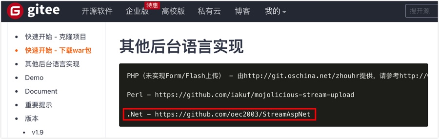
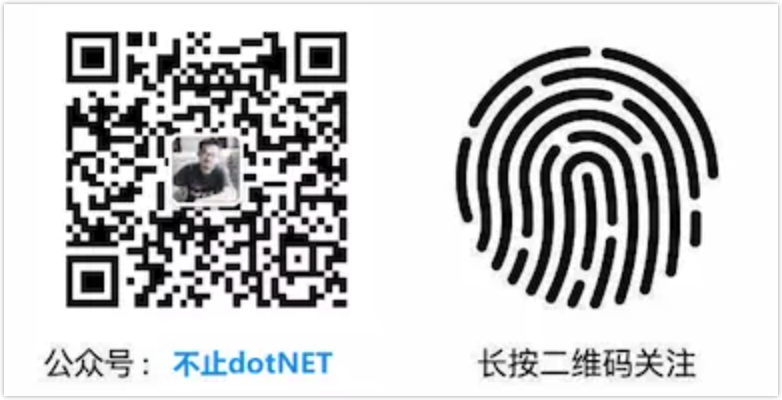

# 联系方式
- 手机：18062159382
- Email：oec2003@gmail.com
- 微信号：oec2003

---

# 个人信息

 - 冯威/男/
 - 本科/军械工程学院/计算机科学与技术 
 - 工作年限：10年以上
 - 技术博客：http://fwhyy.com
 - Github：http://github.com/oec2003
 - 公众号：不止dotNET
 - 期望职位：架构师/技术总监/研发团队负责人

---

# 工作&项目经历
## 武汉爱科软件 （ 2013年9月 ~ 至今 ）

### 时间线

* 2013 年以项目经理职位进入公司，负责东风本田协同办公项目；
* 2014 年在公司推广使用 Git ，并在一个月内将所有源代码迁移到 Gitee；
* 2014 年凭借之前在明源的经验，开发了一套表单控件，使用 xml 配置，在项目实施过程中极大提高效率；
* 2015 年公司组建产品研发部，担任部门经理；
* 2015 年开始带领团队开发 AD 管理平台、企业云盘产品；
* 2016 年搭建私有 Gitlab ，并将代码迁移到 Gitlab ，并部署 Jenkins 实现持续集成；
* 2016 ~ 2017 年从零开始开发零代码平台（当时还没有零代码的概念）,同时完善着企业云盘的功能；
* 2018 ~ 2019 年重构零代码平台，实现前后端分离；
* 2020 ~ 2021 按照规划迭代零代码平台功能，并在 2021 年下半年开始进行 SaaS 化改造。

### 职责

**技术**：核心代码编写/产品整体架构/技术选型/发布部署

**业务**:

* 各产品线的业务落地，主要根据老板的想法转化为最终要实现的业务功能
* 收集项目团队的反馈和意见，进行后续版本的规划

**管理**：成员管理/制度制定/绩效考核/培训/技术分享

### 项目

#### 零代码平台

从零开始构建零代码平台的产品，从流程引擎、表单引擎、视图引擎、规则引擎、BI 等一路走来花了好几年的时间，其中经历了两次大的产品重构：

1、从最初 .NET Framework 4.6 MVC 切换到前后端分离，采用 Angular 4 + dotNET Core 2.1 ;

2、前端替换为 Vue ，后端升级为 dotNET Core 3.1 。

产品经历了从一开始客户的各种吐槽到现在的一致认可，在这个过程中产品功能、管理、技术都得到了快速的提升。

一点成绩：

* 2019 年，江铃汽车升级到我们平台，3 个月完成了 100 多个流程的迁移，并顺利上线；
* 2020 年，葛洲坝集团的科技项目 200 多个功能模块，一个月搭建完成；
* 2021 年，省公安厅情指勤舆项目要切换 gp 数据库，得益于平台良好的设计，2 天就适配了 gp 数据库；

#### 企业云盘

解决企业的非结构化的文档存储问题。做这个产品的过程中学习到很多，技术上有较大的挑战，比如：MongoDB、GridFS、supersocket、多端客户端（win、mac）、、双向同步、同步盘等。

2016 年产品发布，并在神龙汽车、武汉地铁集团、烽火科技等企业落地。

* 神龙汽车实施过程中进行了 PB 级数据的迁移；
* 武汉地铁集团对 UI 风格有自己的要求，由于产品是前后端分离设计，很迅速就定制了符合客户需求的 UI 界面。

#### AD 管理平台

传统的大型企业在使用 AD 过程中有一个痛点，管理员需要登陆服务器才能进行各种操作，分级授权比较麻烦。

AD 管理平台就是为了解决这个问题而诞生，而且还设计了三权分立，受到很多军工企业的喜欢。

## 武汉明源 （ 2011年7月 ~ 2013年9月 ）

以中级开发职位进入公司，而后便升为中级开发 Leader ，在项目研发部门工作。

#### 重点事迹

1、青岛中冶外网采招专项使用的是新控件，在这个专项中除了对招投标业务的熟悉外，对控件的封装方面也学习到了很多，在其中也修改和扩展了一些底层封装；

2、业余时间开发了一个小工具，用来管理代码地址、数据库地址、生成配置文件，极大提升效率；

3、搭建团队技术博客，让每个人的个人知识沉淀能够集中起来，实现知识共享；

4、参选《技术开发牛人》，并获得 2012 年度最佳开发质量奖。

---

# 开源项目
2015 年使用 `stream` 上传组件，因为没有 .NET 版本，便实现了一个：

https://github.com/oec2003/StreamAspNet

后来被作者加入到了官方的 .NET 实现中。

## 技能关键字

C# 、.NET、dotNET Core 、分布式、微服务、Spring Cloud、敏捷开发、持续集成、团队管理、软件架构、Docker 、k8s 

---

# 致谢
感谢您花时间阅读我的简历，期待能有机会和您共事。

